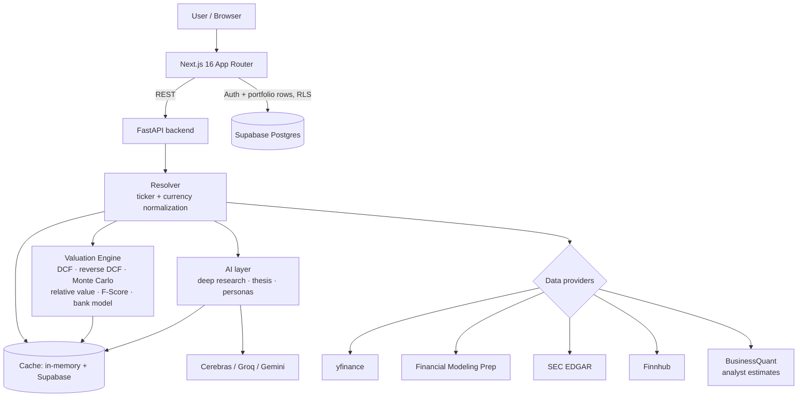

# Moat

**Equity research that computes an explainable intrinsic value — then shows its work.**

Moat combines deterministic valuation models with AI-assisted research. Give it a ticker: a Python engine assembles financial statements from five providers, runs a quality-weighted valuation (DCF, reverse DCF, Monte Carlo, relative multiples, a bank-specific model), and reports which method produced which number, at what weight, under what assumption. When the data isn't there, it says so instead of inventing a figure.

**[Live demo](https://moat-steel.vercel.app)** · *First load may take ~30s — the backend sleeps on a free tier.*


---

## Key Highlights

- **Five-provider data pipeline** with an ordered fallback chain (yfinance → FMP → SEC EDGAR + Finnhub). The valuation engine runs unchanged on whichever provider answers, via a common yfinance-shaped adapter.
- **A moat score that drives the model.** Competitive durability (0–100) sets the DCF's explicit growth horizon (5–12 years) and its growth-fade rate — so a fortress compounder and a commodity business aren't valued on the same assumption.
- **Company-type-aware valuation.** Banks are valued on excess returns (justified P/B), not a free-cash-flow DCF that would be noise; hyper-capex names get an earnings anchor.
- **Monte Carlo over point estimates** — 1,000 paths produce a P10–P90 band rather than one false-precise number.
- **AI is walled off from the math.** Every intrinsic value comes from Python. LLMs only read the computed outputs and write narrative.
- **Normalization choke point** — one resolver reconciles per-provider ticker spellings and converts foreign-currency statements, so no downstream consumer sees provider quirks.
- **Honest degradation** — explicit "insufficient data" states, per-IP rate limiting, negative caching, and a persistent cache that survives free-tier restarts.

---

## Why I Built This

Most retail stock tools do one of two things: dump raw numbers with no interpretation, or show a single "fair value" with no visible methodology. Neither helps you reason about a business.

Moat takes the harder version: assemble reliable fundamentals from imperfect free sources, run defensible methods, and **expose the reasoning**. The interesting engineering isn't any single formula — it's keeping data trustworthy across five providers, applying the right valuation lens to different company types, and failing honestly when inputs are missing.

---

## Architecture



The frontend renders results and owns auth/portfolio state, talking to Supabase directly under row-level security. Everything computational goes to FastAPI, where thin **routers** sit over reusable **services** — all provider keys and all math live there.

The resolver is the load-bearing piece: a single choke point where a ticker becomes each provider's spelling and foreign statements convert to the trading currency. Every downstream consumer — valuation, charts, metrics, AI — sees one consistent shape.

---

## Valuation Engine

The design goal: the headline number must be explainable by its parts. Several independent methods run, then blend by measured reliability rather than a fixed formula.

| Method | What it does |
|--------|--------------|
| **Moat score → CAP** | Scores durability (0–100) from ROE, FCF margin, growth consistency, margin stability, and F-Score. Maps to a 5–12 year growth horizon and a fade curve (0.78 → 0.93 decay). |
| **DCF** | Two-stage discounted cash flow over the CAP, growth fading to a terminal rate. WACC from CAPM with a floor, so low-beta names don't get an implausible discount rate. |
| **Reverse DCF** | Solves by bisection for the growth rate the *current price* implies — "the market is pricing X% vs the analyst trend of Y%." |
| **Monte Carlo** | 1,000 deterministic paths sampling growth, discount rate, terminal rate, and base cash flow → a P10–P90 band. |
| **Relative value** | Own-history multiples (P/E, P/S, P/EBITDA, P/FCF, P/B) with split-adjusted per-share history, plus a conglomerate path anchoring mark-to-market-heavy holdings on P/B. |
| **Earnings multiple** | Growth-anchored fair-P/E × EPS, capped against the market multiple, to keep hyper-capex names (thin reported FCF) sane. |
| **Bank / insurer model** | Excess-return valuation: justified P/B = (ROE − g) / (Ke − g). |
| **Piotroski F-Score** | Nine-point fundamental-health score from the statements. |
| **Ensemble + confidence** | Sources weighted by measured reliability (FCF quality, forward-estimate availability, earnings stability). Confidence is capped when the model diverges sharply from the market. |


---

## Data Reliability

Free financial data is inconsistent and rate-limited, so most of the engineering is in making it trustworthy.

- **Ordered fallback.** yfinance (fast, but blocked on cloud IPs) → FMP (primary, budget-capped) → SEC EDGAR + Finnhub (free, uncapped). A common adapter means the engine never sees which one answered.
- **Ticker normalization.** One helper emits each provider's expected spelling — `BRK.B` becomes `BRK-B` for yfinance/FMP/SEC but stays `BRK.B` for Finnhub. Share-class tickers previously failed silently.
- **Currency normalization.** ADRs that trade in USD but report in another currency (a DKK filer, say) are detected at the resolver and converted, so per-share math is consistent page-wide.
- **Budget-aware price refresh.** A cached valuation is 24h old but its quote isn't: reads refresh the price from free sources only (yfinance fast_info → Finnhub), deliberately never spending the capped FMP budget on a quote.
- **Two-tier cache.** In-memory for speed; persistent Supabase underneath, so a free-tier restart doesn't re-spend the provider budget recomputing what it already knew.
- **Honest degradation.** No provider, no number — an explicit "insufficient data" state, never a fabricated valuation.


---

## AI Features

**AI never produces the intrinsic value.** The DCF, F-Score, and multiples are computed in Python; models receive those outputs and write prose about them.

- **Deep Research report** — structured multi-section diligence (business model, moat rating, competitors, management, unit economics, risks, scenarios, red flags) under a fixed JSON schema.
- **Investor personas** — six investors (Buffett, Munger, Lynch, Burry, Ackman, Graham) evaluate the stock in their documented style, returning a score, verdict, and bull/bear case grounded in the actual numbers.
- **Thesis + valuation review** — a concise thesis, and a second opinion *on the model's output*.

Providers run as a fallback chain (Cerebras → Groq → Gemini). Per-key locks collapse a burst of identical requests into one generation.


---

## Technology Stack

| Layer | Technology |
|-------|------------|
| **Frontend** | Next.js 16 (App Router), React 19, TypeScript, Tailwind CSS 4, Recharts, Framer Motion, jsPDF |
| **Backend** | Python, FastAPI, pandas |
| **Database** | Supabase (PostgreSQL) |
| **Authentication** | Supabase Auth with Row-Level Security |
| **Financial data** | Financial Modeling Prep, SEC EDGAR, Finnhub, BusinessQuant, yfinance |
| **AI** | Cerebras, Groq, Google Gemini (fallback chain) |
| **Deployment** | Vercel (frontend), Render (backend) |

---

## Engineering Challenges

- **Multi-provider consistency.** Five sources spell tickers differently, report in different currencies, scale share counts differently, and rate-limit on different schedules. A normalization choke point plus a common statement adapter keeps provider quirks out of the engine entirely.
- **One model doesn't fit every company.** A blanket DCF is wrong for banks (FCF is noise), for insurance conglomerates (book value is mark-to-market-heavy), and for hyper-capex names (reported FCF understates earning power). Each routes to the right model — and misclassification had to be resolved by *industry*, not sector, since "Banks — Diversified" and a payment network are not the same business.
- **Statements arrive broken.** Missing rows, misaligned years, scaled units. Cash flow is joined by *date* rather than array position (positional pairing silently added 2023 OCF to 2021 capex); CAGR is measured over the true elapsed span; per-share figures are guarded against share-count scale errors. One bad field shouldn't yield an absurd valuation — and each of these bugs did exactly that before being fixed.
- **Honest degradation over confident wrongness.** For financial software, "insufficient data" is the correct failure mode. The engine caps confidence when it diverges from the market and refuses to emit a number when inputs genuinely aren't there.
- **Caching under a sleeping host.** The free-tier backend restarts often, wiping memory. A persistent Supabase tier keeps valuations alive across restarts so the capped provider budgets survive the day.


---

## Production Considerations

- **Rate limiting** — per-IP fixed-window ASGI middleware: 40 req/min general, 8 req/min for expensive AI endpoints, protecting free provider budgets on a public, key-less API.
- **Input validation** — tickers validated (`A–Z 0–9 . -`, bounded length) at the request boundary, closing a query-parameter injection into provider URLs.
- **Security** — no unauthenticated write endpoints; provider keys live only on the backend; portfolio rows are isolated per user by Postgres RLS (select/insert/update/delete policies keyed on the authenticated user).
- **Error handling** — provider clients never raise; they return null-or-fallback, so one failure can't 500 a response.
- **Caching** — 24h for intraday-stable valuations with a live price refresh on read; negative caching so typos and bots don't re-walk the provider chain.


---

## Running Locally

**Prerequisites:** Node.js 20+, Python 3.11+, a Supabase project (free tier).

```bash
# Backend
cd backend
python -m venv .venv && source .venv/bin/activate   # Windows: .venv\Scripts\activate
pip install -r requirements.txt
cp .env.example .env                                 # provider + Supabase keys
uvicorn main:app --reload --port 8000
```

```bash
# Frontend
cp .env.example .env.local                           # NEXT_PUBLIC_API_BASE_URL + Supabase
npm install
npm run dev                                          # http://localhost:3000
```

Provider keys are individually optional — the app degrades gracefully when one is unset (no AI key disables the AI cards; the valuation engine still runs).

---

## Known Limitations

- **Cold starts.** Free-tier hosting sleeps when idle; the first request after inactivity takes ~30–60s.
- **Foreign ADRs.** Coverage depends on yfinance, since SEC EDGAR carries 20-F filers in a shape the statement parser doesn't read and free FMP tiers don't cover them. When yfinance is unavailable, these degrade to a price-only or "insufficient data" state. ADR ratios are not modeled.
- **Provider budgets.** Once the primary provider's daily cap is spent, some valuations take a less precise path — flagged in the confidence score.
- **Screener scope.** A periodic batch snapshot over the S&P 500, not on-demand across the full market.

---

## Future Improvements

- 20-F-aware statement parsing to close the foreign-ADR gap.
- Async LLM I/O for concurrency headroom.
- On-demand incremental screening alongside the batch snapshot.

---

*Moat is a research and educational tool. Nothing it produces is financial advice.*
