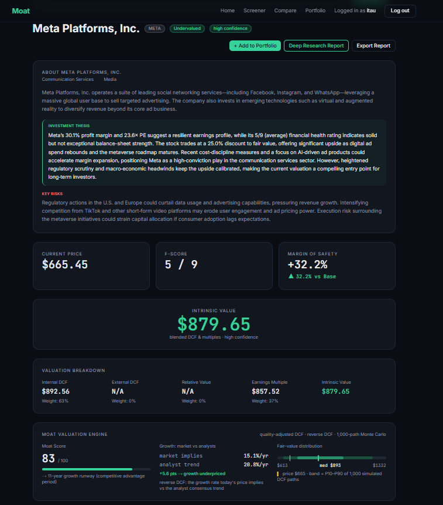
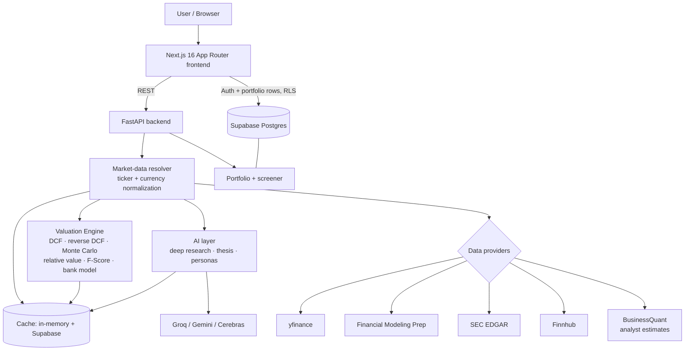
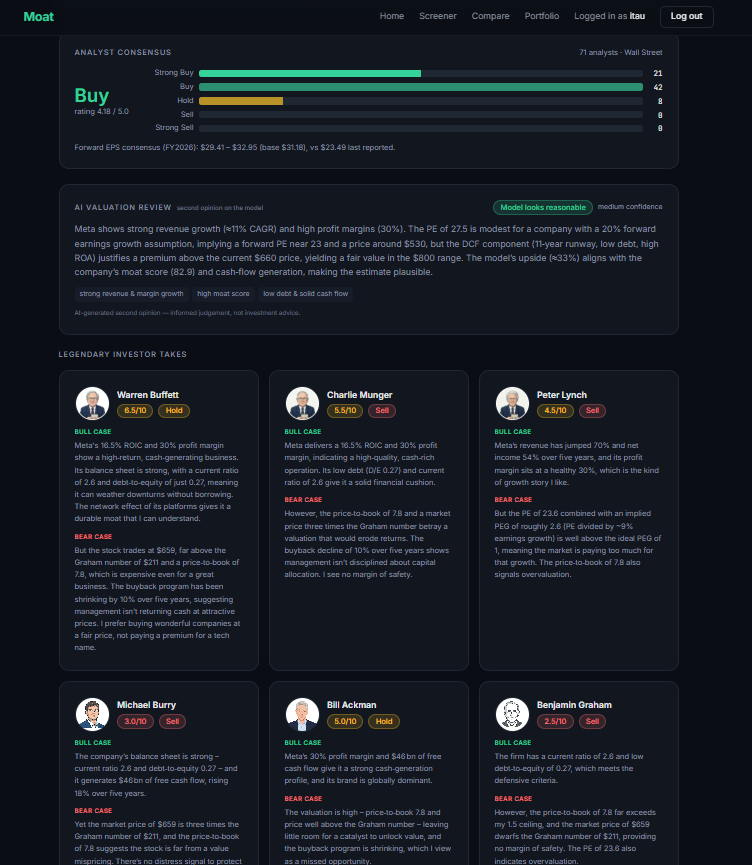
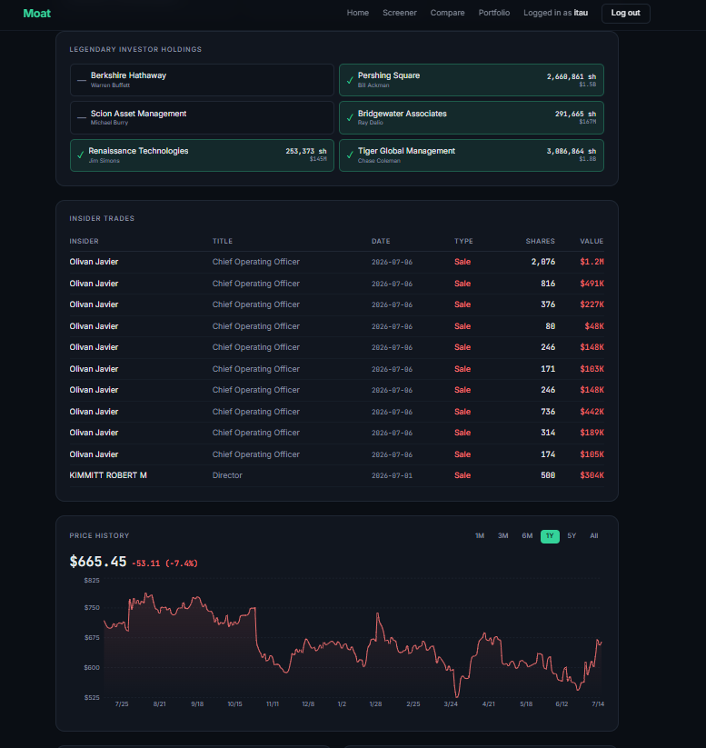
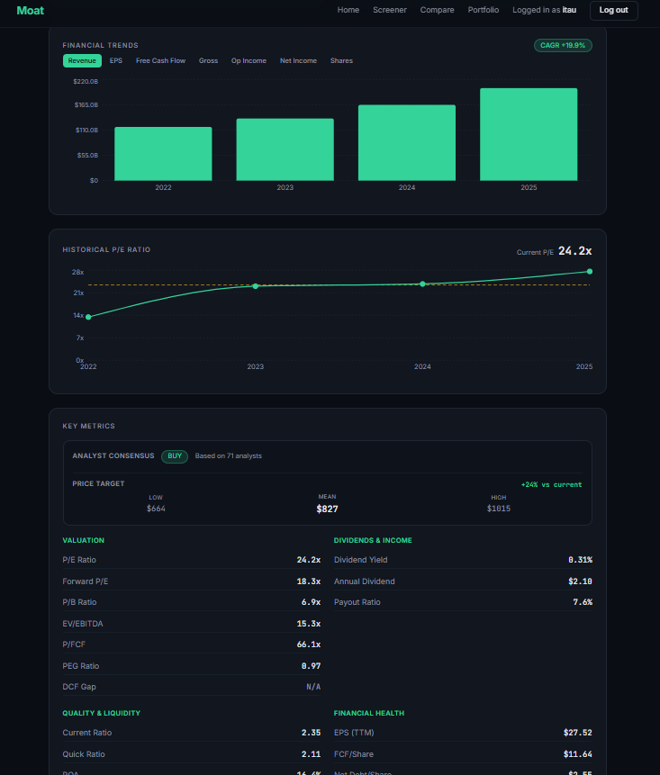
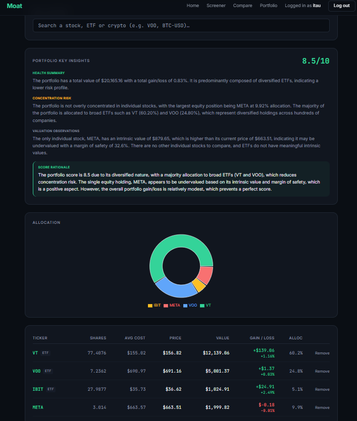
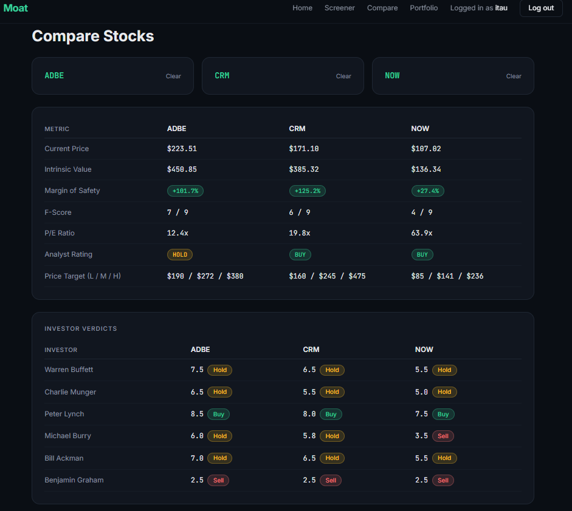

# Moat

**An equity-research application that computes an explainable intrinsic value for any stock — then shows its work.**

Moat takes a ticker and runs a quality-weighted valuation engine (DCF, reverse DCF, Monte Carlo, relative multiples, a bank-specific model) over financial statements assembled from multiple providers, scores it with a Piotroski F-Score, layers on real analyst consensus, and generates AI investment research on top — with a persistent portfolio tracker and a stock screener. Every number is traceable to a source or a documented assumption; when data isn't available, the app degrades honestly instead of inventing a figure.



---

## Key Highlights

- **Multi-provider data pipeline** with an ordered fallback chain (yfinance → FMP → SEC EDGAR + Finnhub) and a stale-quote cross-check, so a single provider outage or a rate-limit doesn't take the app down.
- **Explainable valuation engine** — DCF, reverse DCF, a 1,000-path Monte Carlo band, and a diagnostic-weighted ensemble, all surfaced in the UI with the weight each method contributed.
- **A quality-driven moat score** that sets the DCF's growth horizon (competitive advantage period), so durable compounders and commodity businesses aren't valued on the same 5-year assumption.
- **Bank/insurer-specific valuation** — balance-sheet financials are valued on excess returns (justified P/B), not a meaningless free-cash-flow DCF.
- **Real analyst consensus** from a single source, consistent across the analysis, compare, and metrics views.
- **AI investment research** (deep-research report, thesis, valuation second-opinion, six legendary-investor personas) — clearly separated from the deterministic financial models.
- **Portfolio tracking** with live valuation, allocation, and an AI portfolio review, protected by Postgres row-level security.
- **Persistent caching** in Supabase that survives free-tier host restarts, keeping the limited provider budgets from draining.
- **Production hardening** — per-IP rate limiting, ticker validation, currency normalization, and negative caching.

---

## Why I Built This

Most retail stock tools do one of two things: they dump raw numbers with no interpretation, or they show a single "fair value" with no visible methodology. Neither is useful if you actually want to reason about a business.

Moat is an attempt at the harder version of the problem: assemble reliable fundamentals from imperfect free data sources, run defensible valuation methods, and then **expose the reasoning** — which model produced which number, at what weight, under what growth assumption, and how confident the result is. The engineering interest is less in any single formula and more in everything around it: keeping the data trustworthy across five providers, applying the right valuation lens to different company types, and failing honestly when the inputs aren't there.

---

## Architecture



The frontend is a typed client: it renders results and owns auth/portfolio state (talking to Supabase directly under row-level security), and calls the FastAPI backend for everything computational. The backend is thin HTTP **routers** over reusable **services**; all provider keys and all computation live there. A single resolver is the choke point where a ticker is normalized to each provider's spelling and foreign statements are converted to the trading currency — so every downstream consumer (valuation, charts, metrics, AI) sees consistent data.

---

## Valuation Engine

The engine's design goal is that the same headline number can be explained by its parts. It runs several independent methods and blends them by measured reliability rather than a fixed formula.

| Method | What it does |
|--------|--------------|
| **Moat score → CAP** | Scores competitive durability (0–100) from ROE, FCF margin, growth consistency, margin stability, and F-Score, then maps it to a 5–12 year explicit growth horizon (competitive advantage period) and a growth-fade curve. |
| **DCF** | Two-stage discounted cash flow over the CAP, with growth fading toward a terminal rate; WACC from CAPM with a floor so low-beta names don't get an implausibly low discount rate. |
| **Reverse DCF** | Solves (via bisection) for the growth rate the *current price* implies, so the UI can show "the market is pricing X% vs the analyst trend of Y%." |
| **Monte Carlo** | ~1,000 deterministic paths sampling growth, discount rate, terminal rate, and base cash flow to produce a P10–P90 fair-value band instead of a single false-precise point. |
| **Relative value** | Multi-factor own-history multiples (P/E, P/S, P/EBITDA, P/FCF, P/B) with split-adjusted per-share history and a conglomerate path that anchors mark-to-market-heavy holdings on P/B. |
| **Earnings multiple** | A growth-anchored fair-P/E × EPS anchor, capped against the current market multiple, to keep hyper-capex names (thin reported FCF) sane. |
| **Bank / insurer model** | Balance-sheet financials use an excess-return (justified P/B = (ROE − g)/(Ke − g)) valuation instead of an FCF DCF, which is noise for a bank. |
| **Piotroski F-Score** | Nine-point fundamental-health score computed from the statements. |
| **Confidence + ensemble** | Sources are weighted by measured reliability (FCF quality, whether a forward estimate exists, earnings stability); confidence is capped when the model diverges sharply from the market, and an AI reviewer gives an independent second opinion. |



The **AI Valuation Review** above is a second opinion *on the model's output* — it does not produce the intrinsic value itself. The intrinsic value comes entirely from the deterministic engine.

---

## Data Pipeline

Free financial data is inconsistent and rate-limited, so most of the engineering is in making it trustworthy.

- **Ordered provider fallback.** The resolver tries yfinance (fast, blocked on cloud IPs), then FMP (primary, budget-capped), then the free/uncapped SEC EDGAR + Finnhub combination. The full valuation engine runs unchanged on whichever succeeds via a common yfinance-shaped adapter.
- **Ticker normalization.** One helper produces each provider's expected spelling (e.g. `BRK.B` → `BRK-B` for yfinance/FMP/SEC, `BRK.B` for Finnhub), so share-class tickers resolve everywhere instead of failing silently.
- **Currency normalization.** Foreign filers that trade in USD but report in another currency (e.g. a DKK-reporting ADR) are detected at the resolver and their statements converted to the trading currency, so per-share math is consistent across the whole page.
- **Stale-quote cross-check.** A price is validated against a second live feed; if they diverge sharply, the fresher one wins — a stale quote silently poisons every ratio downstream.
- **Two-tier cache.** An in-memory cache for speed plus a persistent Supabase cache that survives the host's free-tier restarts, so a computed valuation isn't re-fetched (and the provider budget re-spent) on every cold start.
- **Honest degradation.** When no provider can supply the essentials, the app returns an explicit "insufficient data" / price-only state rather than a fabricated valuation.




---

## AI Features

AI is used for **narrative research**, never for the valuation number.

- **Deep Research report** — a structured, multi-section diligence report (business model, moat rating, industry, competitors, management, financial history, unit economics, risks, growth drivers, scenarios, red flags, investment summary), generated from the same computed fundamentals under a fixed JSON schema.
- **Investor personas** — six legendary investors (Buffett, Munger, Lynch, Burry, Ackman, Graham) each evaluate the stock in their documented style, returning a score, verdict, and bull/bear case grounded in the actual numbers.
- **Investment thesis + valuation review** — a concise thesis and an independent AI second-opinion on the model's intrinsic value.

Every AI feature is fed the deterministic outputs (statements, ratios, the model's own valuation) and is prompted to reason from them; the DCF, F-Score, and multiples are computed in Python, not by a model. Providers run as a fallback chain (Groq → Gemini → Cerebras) with per-key locks so a burst of identical requests collapses into one generation.

---

## Technology Stack

| Layer | Technology |
|-------|------------|
| **Frontend** | Next.js 16 (App Router), React 19, TypeScript, Tailwind CSS 4, Recharts, Framer Motion, jsPDF |
| **Backend** | Python, FastAPI, pandas |
| **Database** | Supabase (PostgreSQL) |
| **Authentication** | Supabase Auth with Row-Level Security |
| **Financial data** | Financial Modeling Prep, SEC EDGAR, Finnhub, BusinessQuant, yfinance |
| **AI** | Groq, Google Gemini, Cerebras (fallback chain) |
| **Deployment** | Vercel (frontend), Render (backend) |
| **Languages** | TypeScript, Python |

---

## Repository Structure

```
moat/
├── src/                      # Next.js frontend
│   ├── app/                  # Routes: home, /analyze/[ticker], /screener, /compare, /portfolio
│   ├── components/           # Analysis cards, charts, portfolio, PDF export
│   └── lib/                  # API client, Supabase client, auth context
├── backend/                  # FastAPI backend
│   ├── routers/              # Thin HTTP endpoints (analyze, portfolio, screener, ownership, ...)
│   ├── services/             # Core logic: valuation_engine, dcf, relative_value, blend,
│   │                         #   piotroski, provider clients, llm_providers, caching
│   ├── ratelimit.py          # Per-IP rate limiting + ticker validation
│   └── config.py             # Environment / key configuration
└── docs/                     # Documentation and images
```

---

## Engineering Challenges

- **Multi-provider consistency.** Five data sources spell tickers differently, report in different currencies, scale share counts differently, and rate-limit on different schedules. Getting a single coherent valuation out of them required a normalization choke point and a common statement adapter so the engine never sees provider-specific quirks.
- **Different valuation lenses for different companies.** A blanket DCF is wrong for banks (FCF is noise), for insurance conglomerates (book value and GAAP earnings are mark-to-market-heavy), and for hyper-capex names (reported FCF understates earning power). Each is routed to the appropriate model, and mis-classification (e.g. a payment network vs. a bank) had to be handled by industry, not sector.
- **Incomplete financial statements.** Statements arrive with missing rows, misaligned years, and scaled units. Cash flow is joined by date (not array position), CAGR is measured over the true elapsed span, and per-share figures are guarded against share-count scale errors — all so a single bad field can't silently produce an absurd valuation.
- **Honest degradation over confident wrongness.** For financial software, returning "insufficient data" is the correct failure mode. The engine flags low confidence when it diverges from the market and refuses to emit a number when the inputs genuinely aren't there.
- **Caching under a free-tier host.** The backend sleeps and restarts frequently, which wipes in-memory state; a persistent Supabase cache keeps valuations and analyst estimates alive across restarts so the limited provider budgets last.




---

## Production Considerations

- **Rate limiting** — per-IP fixed-window limits (a looser general tier and a stricter tier for expensive AI endpoints), implemented as ASGI middleware, to protect the free provider budgets on a public, key-less API.
- **Input validation** — tickers are validated (`A–Z 0–9 . -`, bounded length) at the request boundary, which also closes a query-parameter injection into provider URLs.
- **Negative caching** — tickers that resolve to nothing are remembered briefly so typos and bots don't re-walk the whole provider chain and burn paid calls.
- **Security** — no unauthenticated write/side-effect endpoints; provider keys live only on the backend; portfolio data is isolated per user with Postgres row-level security (select/insert/update/delete policies keyed on the authenticated user).
- **Error handling** — provider clients never raise; they return null-or-fallback so one failure can't 500 a whole response.
- **Caching strategy** — 24h for intraday-stable valuations/statements with a live price refresh on read; short TTLs for price history; persistent tier across restarts.

---

## Running Locally

**Prerequisites:** Node.js 20+, Python 3.11+, a Supabase project (free tier is fine).

**Backend**
```bash
cd backend
python -m venv .venv && source .venv/bin/activate   # Windows: .venv\Scripts\activate
pip install -r requirements.txt
cp .env.example .env                                 # fill in provider + Supabase keys
uvicorn main:app --reload --port 8000
```

**Frontend**
```bash
cp .env.example .env.local                           # set NEXT_PUBLIC_API_BASE_URL + Supabase
npm install
npm run dev                                          # http://localhost:3000
```

All provider keys are optional individually — the app degrades gracefully when one is unset (e.g. no AI key disables the AI cards but leaves the valuation engine intact). See `backend/.env.example` and `.env.example` for the full list.

---

## Known Limitations

- Hosted on free tiers; the backend sleeps when idle, so the **first request after inactivity can take ~30–60s** to wake (cold start).
- **Foreign ADRs** have limited free-provider coverage; when the primary sources are unavailable, these degrade to a price-only or "insufficient data" state rather than a guessed valuation. American-depositary-share ratios are not fully modeled.
- Free-tier data caps mean that, once the primary provider's daily budget is spent, some valuations fall back to a slightly less precise path (clearly flagged in confidence).
- The screener runs as a periodic batch job over the S&P 500 rather than on-demand for the full market.

---

## Future Improvements

- Broaden foreign / ADR coverage with an ADR-ratio-aware statement path.
- Move the LLM calls to async I/O to raise concurrency headroom.
- Add an on-demand incremental screener alongside the batch snapshot.

---

*Moat is a research and educational tool. Nothing it produces is financial advice.*
